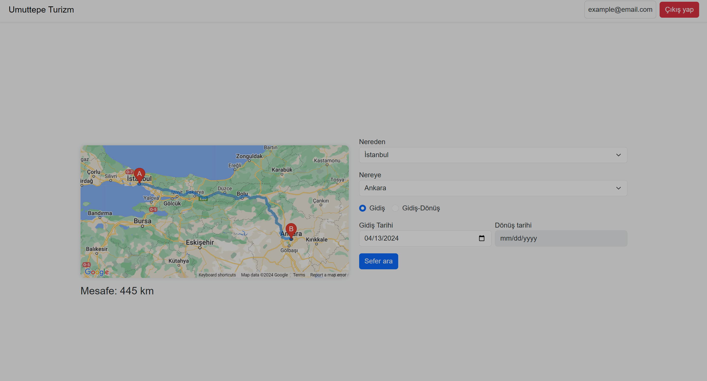
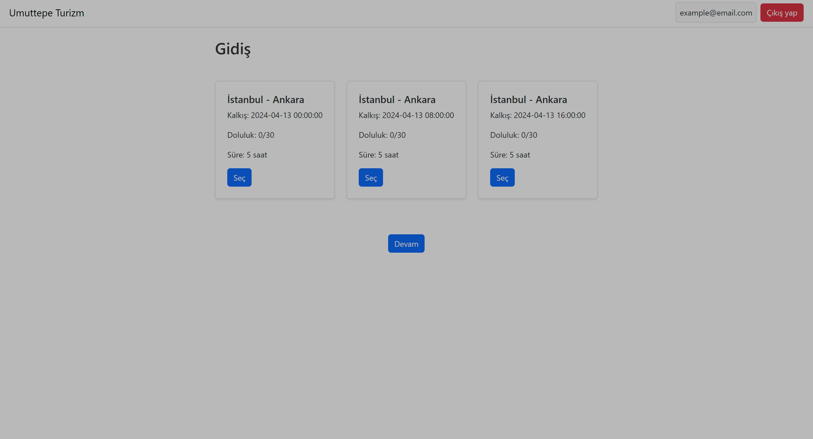
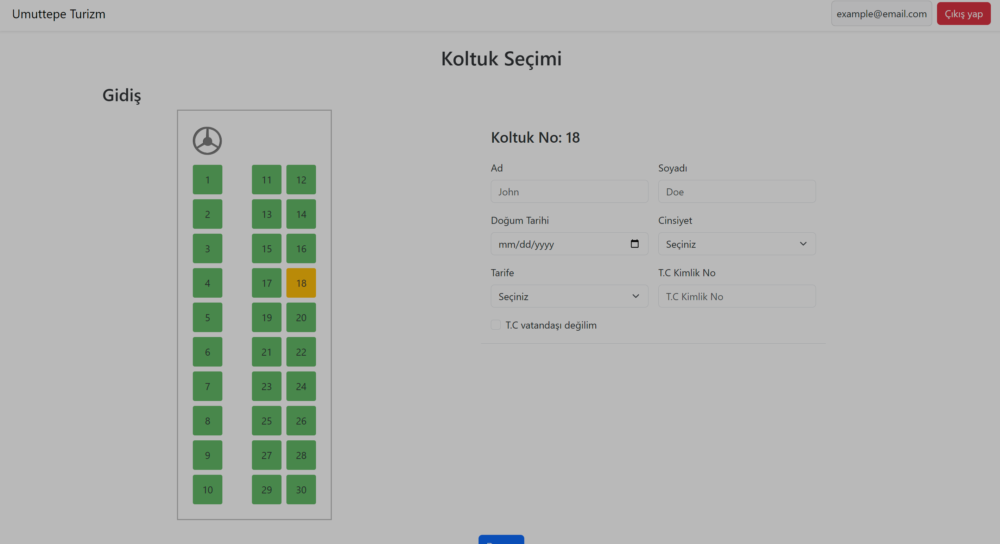
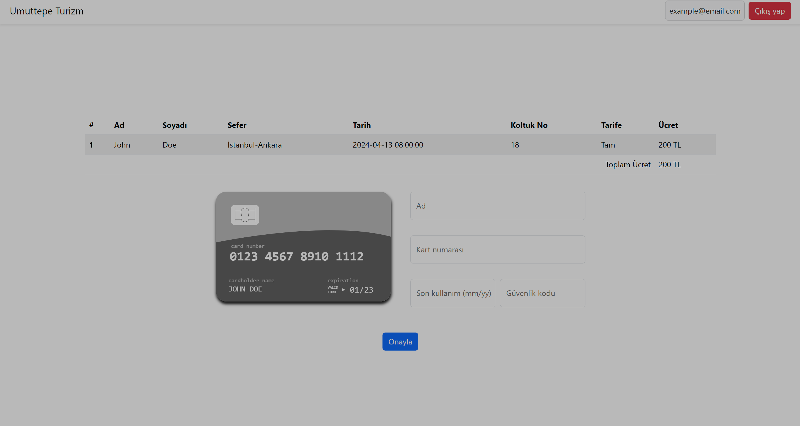
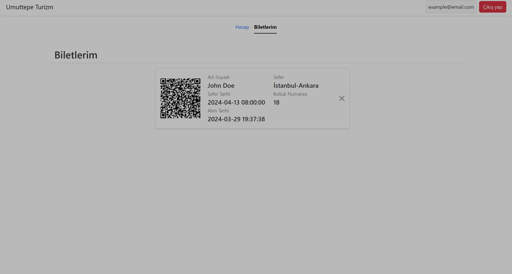

# Umuttepe Turizm

This Web application is about a tourism company that provides bus services to different cities.

## Features

- User registration
- User login
- User profile
- Search for available trips
- Book a trip

## Screenshots











## Getting Started

### Prerequisites

- PHP 8.0+
- Composer
- MySQL

### Installation

Clone the repository

```bash
git clone https://github.com/Kerem-Ishik/umuttepe-turizm.git
```

Install dependencies

```bash
cd umuttepe-turizm
composer install
```

Create a `.env` file

```bash
cp env .env
```

Edit the `.env` file

```env
database.default.hostname = localhost
database.default.database = umuttepe_turizm
database.default.username = <username>
database.default.password = <password>
database.default.DBDriver = MySQLi
database.default.port = 3306
```

Create the database with the SQL file called `umuttepe_turizm.sql`

Start the development server

```bash
php spark serve
```
